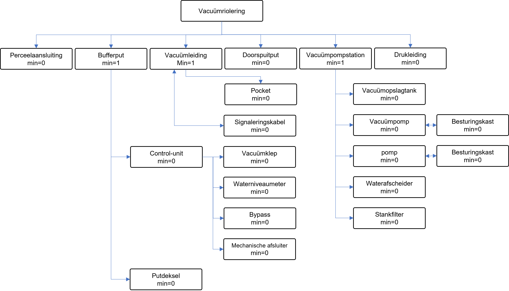

# Vacuümriolering

Stichting RIONED is initiatiefnemer en eigenaar van dit GitHub-project, Eric Oosterom is de verantwoordelijk projectmanager. 

Vragen over deze website en het GWSW kunt u stellen via gwsw@rioned.org. 

# Inleiding
Vacuümriolering is een systeem waarbij afvalwater door middel van onderdruk wordt getransporteerd. Er bestaan verschillende configuraties, maar doorgaans lozen één of meerdere panden onder vrijverval op een bufferput met een klepmechanisme. Zodra een vooraf ingestelde waterdiepte is bereikt, opent de klep. Door de onderdruk in de vacuümleiding wordt vervolgens een mengsel van afvalwater en lucht uit de bufferput gezogen en naar het centrale vacuümstation getransporteerd. Vacuümpompen in dit station zorgen voor de benodigde onderdruk. Vanaf het vacuümstation wordt het afvalwater geloosd op een benedenstrooms rioolstelsel of direct afgevoerd naar een rioolwaterzuiveringsinstallatie.

Uit een rondvraag van RIONED volgde dat gemeenten die vacuümriolering hebben, hier tevreden over zijn. Vacuümriolering heeft een duidelijk toepassingsgebied op locaties die tussen landelijk en stedelijk in liggen, waar drukriolering of vrijvervalriolering minder doelmatig is. De ondiepe ligging en flexibiliteit vereenvoudigen de aanleg en mits goed onderhouden zijn storingsaantallen laag.

In 2024 ontving Stichting RIONED signalen uit de sector dat de gebruikte terminologie in het GegevensWoordenboek Stedelijk Water ([GWSW](https://data.gwsw.nl/)) voor vacuümriolering onvolledig zijn en sommige termen niet aansluiten bij de beroepspraktijk. Het GWSW is een open standaard, ontwikkeld en beheerd door Stichting RIONED namens de sector. Het doel van deze ontologie is het verbeteren van de kwaliteit en uitwisselbaarheid van data door het gebruik van een gemeenschappelijke taal. Eind 2024 is een notitie met wijzigingsvoorstellen rondgestuurd aan vacuümrioleringbeheerders. Dit ontwerpdocument is gebaseerd op de aangepaste versie van deze notitie.

## Doel en toepassing
Ondersteuning bij de uitwisseling van vaste gegevens over vacuümriolering. Daarnaast vervult het GWSW ook een woordenboekfunctie waarmee uniformiteit ontstaat in de gebruikte termen en de samenhang tussen objecten binnen de sector. Dit is ook van belang voor gemeenten die zelf nog geen vacuümriolering hebben, maar dit wel overwegen.

## Leeswijzer
De opbouw van dit ontwerpdocument is als volgt; eerst zijn de veelgebruikte termen van vacuümrioleringleveranciers geïnventariseerd. Daarna is een overzicht gegeven van vacuümriolering in het GWSW. Ten slotte zijn aanbevelingen gedaan voor aanpassingen aan het GWSW om dit beter aan te laten sluiten bij de gebruikte termen uit de praktijk en het gewenste detailniveau.

# Gebruikte termen leveranciers
Qua-vac, Flovac en Roediger zijn marktpartijen die vacuümsystemen leveren. Uit een rondgang bij gemeenten met veel kilometer vacuümriolering volgt dat de meeste systemen van Qua-vac afkomstig zijn.

De Engelse website van [Qua-vac] beschrijft de systeemonderdelen uit Figuur 2.1. Allereerst wordt afvalwater via vrijvervalverbindingen op een centrale plek ingezameld. Deze put wordt door zowel Roediger als Qua-vac de verzamelput (collection chamber) genoemd, welke ook een bergende functie heeft in geval van storing. In de brochure van Qua-vac wordt ook de term ‘bufferpot’, oftewel bufferput, gebruikt. Flovac heeft het over een collection pit, oftewel een verzamelput. Tabel 2.1 geeft een overzicht van de verschillende termen die de leveranciers hanteren.

*Figuur 2.1 - Systeemonderdelen van het Vacuflow systeem van Qua-vac. Bron: https://quavac.com/vacuum-sewer-system/*

Roediger heeft het in de brochure over een besturingseenheid (control unit) om de vacuümklep te activeren bij het inschakelpeil. Flovac hanteert de term [controller] voor de bediening van de vacuümklep. Bij Qua-vac is de interface unit het geheel aan kleppen, vlotter en afsluiters om de afvoer van afvalwater naar de vacuümleiding te reguleren, zie ook Figuur 2.2. De vlotter onderin Figuur 2.3 opent de vacuümklep afhankelijk van het niveau in de bufferput.

*Figuur 2.2 - Interface unit van Qua-vac met daarin een klep, vlotter, afsluiters en een bypass. Bron: https://quavac.com/nl/infra/*

*Figuur 2.3 - Voorbeeld van een bufferput in Gemeente Molenlanden*

Middels vacuümleidingen wordt het afvalwater van de bufferput naar het centrale vacuümstation getransporteerd. Alle onderzochte fabrikanten hanteren hier dezelfde term voor. De vroegere [NEN 3300:1996] had het over de term vacuümpompstation of een onderdrukpompstation. Meerdere bufferputten kunnen op dezelfde vacuümleiding inprikken. Vacuümleidingen worden in vlak gebied in een zaagtandprofiel gelegd, zoals getoond in (4) van Figuur 2.1. Doel van dit zaagtandprofiel is om op de laagste punten, ook wel pockets genoemd, 'proppen' afvalwater te vormen die lucht en vloeistof insluiten. Deze proppen worden door onderdruk en lucht omhoog gevoerd waarna deze verder worden afgevoerd richting de volgende pocket. 

*Tabel 2.1 - De door leveranciers gebruikte (Engelse) termen voor veel voorkomende systeemonderdelen.*

| **Omschrijving**                                                                                                     | **Roediger**           | **Qua-vac**                    | **Flovac**             |
| -------------------------------------------------------------------------------------------------------------------- | ---------------------- | ------------------------------ | ---------------------- |
| Vrijverval inzamelput die geledigd wordt middels vacuüm                                                              | Collection chamber     | Bufferpot / Collection chamber | Collection Pit         |
| geheel aan kleppen, vlotter en afsluiters om de afvoer van afvalwater naar de vacuümleiding te reguleren             | Control unit\*         | Interface unit                 | Controller\*           |
| Leiding waardoor afvalwater door onderdruk wordt getransporteerd                                                     | Vacuum pipe            | Vacuum pipe                    | Vacuum pipe            |
| Centraal pompstation voor het in stand houden van de onderdruk en het vervolgens verder transporteren van afvalwater | Vacuum pumping station | Vacuum pumping station         | Vacuum pumping station |
| Opslagruimte voor het afvalwater dat via een vacuümleiding wordt aangevoerd                                          | Wastewater tank        | Vacuum tank                    | Collection tank        |

*Bij deze fabrikant gaat het alleen over de bediening van de vacuümklep

Een vacuümstation, of vacuümpompstation ontvangt afvalwater van één of meerdere vacuümleidingen op een centrale plek en is voorzien van:
-Een vacuümtank waar afvalwater vanuit het leidingnetwerk in terecht komt. Flovac noemt dit een [verzameltank], Roediger een afvalwatertank en Qua-vac een vacuümtank. De [NEN 3300:1996] had het over een vacuümopslagtank of een onderdrukopslagtank
-Vacuümpompen om onderdruk te creëren
-Pompen die met overdruk afvalwater vanaf het vacuümstation naar de benedenstroomse riolering of zuiveringsinstallatie te pompen
-Een luchtafscheider om te voorkomen dat vocht uit de vacuümtank in de vacuümpompen belandt
-Een geurfilter om onaangename geuren van de afgezogen lucht af te vangen.

# Bestaande concepten vacuümriolering in het GWSW
Momenteel zijn de in Figuur 3.1 getoonde onderdelen specifiek opgenomen voor vacuümriolering in het [GWSW]. In tegenstelling tot de termen die de fabrikanten hanteren wordt in het GWSW een vacuümopslagtank als hoofdterm gehanteerd voor de bufferput (bufferput is wel opgenomen als synoniem). Ook zijn onderdelen van een vacuümpompstation zoals een luchtafscheider, vacuümpomp, geurfilter, etc. niet gedefinieerd.

*Figuur 3.1 - Bestaande concepten vacuümriolering in het [GWSW]*

Andere aandachtspunten zijn:
- Een [vacuümleiding] zou geen ontluchter moeten kunnen hebben. Het toepassen van beluchters is in sommige gevallen wel denkbaar
- Een [Vacuümpompstation] is geen deel van een persleidingstelsel

# Nieuwe GWSW-concepten
Figuur 4.1 geeft een overzicht van de voorgestelde aanpassingen voor de fysieke objecten, welke hieronder verder toegelicht zijn. Tabel 4.1 geeft de bijbehorende definities. Inspectiewaarnemingen, metingen of onderhoudsactiviteiten zijn in deze notitie buiten beschouwing gelaten, maar worden mogelijk in de toekomst nog toevoegd.

*Figuur 4.1 - Voorstel concepten vacuümriolering in het GWSW*

**Bufferput** is de voorgestelde term voor een verzamelput met daarin een vacuümklep. De term Verzamelput heeft niet de voorkeur aangezien dit een generieke term is die binnen een ander subdomein van stedelijk water een andere betekenis kan hebben. In het GWSW staat onterecht dat volgens de NEN 3300:1996 bufferput een synoniem is van vacuümopslagtank. Een vacuümklep kan onderdeel zijn van een bufferput, maar het is niet verplicht deze als zodanig in een dataset te definiëren. Ook kan een bufferput straks net als een rioolput worden voorzien van een putdeksel. Ook is het mogelijk om het bergend vermogen van de put als kenmerk toe te voegen.

**Vacuümleiding** bevat al de kenmerken van een generieke rioolleiding zoals begindatum, diameter, lengte, materiaal, wanddikte, etc. Vanuit Gemeente Almere bestaat de wens om locatie en hoogte van pockets expliciet in datasets op te nemen. Dit kan middels een apart onderdeel ‘pockets’ wat voorzien is van een puntoriëntatie en opvoerhoogte als kenmerk. Ook is het mogelijk om in- en uitgaande b.o.b.'s als kenmerk van de vacuümleiding zelf toe te kennen. Een vacuümleiding kan worden voorzien van een signaleringskabel voor nauwkeurige locatiedetectie

Een **vacuümpompstation** of een onderdrukpompstation volgens de NEN 3300:1996 bevat de volgende onderdelen die optioneel beschreven kunnen worden:
- Vacuümopslagtank (onderdrukopslagtank): een opslagruimte voor het afvalwater dat via een vacuümleiding wordt aangevoerd en waarin onderdruk in stand wordt gehouden. Kathodische bescherming en bergend vermogen dienen nog als kenmerk toegevoegd te worden.
- Vacuümpomp: Een pomp die onderdruk creëert waardoor de vloeistof wordt verplaatst.
- Pomp: Een pomp waarbij het verzamelde afvalwater middels overdruk richting het benedenstroomse riool of de zuiveringsinstallatie wordt verpompt. Reeds beschreven in het GWSW maar nog geen onderdeel van een vacuümpompstation. Als synoniem kan perspomp worden toegevoegd.
- Luchtafscheider: Toestel bestemd voor de behandeling van luchthoudend afvalwater, waarbij lucht door het verschil in dichtheid tussen lucht en water uit afvalwater wordt verwijderd.
- Stankfilter: Reeds beschreven in het GWSW, met geurfilter als synoniem. Een stankfilter is nog niet erkend als onderdeel van een vacuümpompstation.

Middels een **drukleiding** wordt het verzamelde water in het vacuümpompstation verder afgevoerd.

*Tabel 4.1 - Uitsnede van vacuümriolering objecten.*

| URI                  | Naam                  | Bestaand  | Definitie                                                                                                                                                                                                                                                                |
| -------------------- | --------------------- | --------- | ------------------------------------------------------------------------------------------------------------------------------------------------------------------------------------------------------------------------------------------------------------------------ |
| Vacuumriolering      | Vacuümriolering       | Ja        | Riolering waarbij het transport plaatsvindt door onderdruk                                                                                                                                                                                                               |
| Perceelaansluiting   | Perceelaansluiting    | Ja        | De aansluiting van een perceel op een rioolstelsel                                                                                                                                                                                                                       |
| Bufferput            | Bufferput             | Aangepast | Put waarin afvalwater onder vrijverval wordt ingezameld en tijdelijk geborgen                                                                                                                                                                                            |
| Vacuumleiding        | Vacuümleiding         | Ja        | Leiding bestemd voor de inzameling en het transport van huishoudelijk- en bedrijfsafvalwater, niet zijnde neerslag waarin het afvalwater door middel van onderdruk wordt getransporteerd                                                                                 |
| Doorspuitput         | Doorspuitput          | Ja        | Een rioolput met voorziening voor het inbrengen van een spuitstuk voor de reiniging van een mechanisch rioolstelsel                                                                                                                                                      |
| Pocket               | Pocket                | Nee       | Laagste punt in het zaagtandprofiel van een vacuümleiding, ontworpen om periodiek een water-luchtprop te vormen. Deze proppen bevorderen het transport van afvalwater door de leiding onder invloed van het vacuüm.                                                      |
| Signaleringskabel    | Signaleringskabel     | Nee       | Synoniem traceerkabel, is een kabel van geleidend materiaal die bovenop de leiding wordt geplaatst tijdens aanleg. Via een zender wordt op de kabel een elektromagnetisch signaal gecreëerd dat vanaf het maaiveld getraceerd kan worden om de leidingligging te bepalen |
| Vacuumpompstation    | Vacuümpompstation     | Ja        | pompstation voor het in stand houden van de onderdruk in vacuümafvoerleidingen en voor het vervolgens onder overdruk verder transporten van het afvalwater                                                                                                               |
| Drukleiding          | Drukleiding           | Ja        | Leiding bestemd voor de inzameling en het transport van huishoudelijk- en bedrijfsafvalwater, niet zijnde neerslag waarin het afvalwater door middel van overdruk wordt getransporteerd                                                                                  |
| Vacuumopslagtank     | Vacuümopslagtank      | Aangepast | Afgesloten tank binnen een vacuümstation waarin afvalwater uit één of meerdere vacuümleidingen tijdelijk wordt geborgen voordat het verder wordt verpompt naar een benedenstrooms rioolstelsel of zuiveringsinstallatie.                                                 |
| Vacuumpomp           | Vacuümpomp            | Nee       | Een technische installatie die het afvalwater onder onderdruk transporteert.                                                                                                                                                                                             |
| Pomp                 | Pomp                  | Ja        | Een technische installatie die het afvalwater onder druk transporteert.                                                                                                                                                                                                  |
| Waterafscheider      | Waterafscheider       | Nee       | Een toestel waarin water van de afgevoerde lucht wordt gescheiden                                                                                                                                                                                                        |
| Stankfilter          | Stankfilter           | Ja        | Een zelf ademend filter om geuren te bestrijden                                                                                                                                                                                                                          |
| ControlUnit          | Control-unit          | Nee       | Geheel aan kleppen, vlotter en afsluiters om de afvoer van afvalwater naar de vacuümleiding te reguleren                                                                                                                                                                 |
| Vacuumklep           | Vacuümklep            | Nee       | Klep die het ledigen van een inzamelingsvoorziening naar een vacuümleiding regelt                                                                                                                                                                                        |
| Waterniveaumeter     | Waterniveaumeter      | Ja        | Een instrument waarmee het waterniveau wordt gemeten                                                                                                                                                                                                                     |
| Bypass               | Bypass                | Nee       | Leidingverbinding waarmee de vacuümklep van een bufferput kan worden omzeild ten behoeve van onderhoud, inspectie of noodafvoer                                                                                                                                          |
| MechanischeAfsluiter | Mechanische afsluiter | Ja        | Een doorlaat met een voorziening om de stroming te regelen                                                                                                                                                                                                               |
| Putdeksel            | Putdeksel             | Ja        | Het deksel waarmee een rioolput wordt afgesloten                                                                                                                                                                                                                         |

[Qua-vac]: https://quavac.com/vacuum-sewer-system/
[GWSW]: https://data.gwsw.nl/?menu_item=classes&item=../../def/1.6.1/Basis/Vacuumriolering
[verzameltank]: https://flovac.com/flovac-vacuum-pump-station/
[controller]: https://flovac.com/flovac-vacuum-system-pe-collection-pit/
[NEN 3300:1996]: https://www.nen.nl/nen-3300-1996-nl-21664
[vacuümleiding]: https://data.gwsw.nl/?menu_item=classes&item=../../def/1.6.1/Basis/Sym_Vacuumleiding
[Vacuümpompstation]: https://data.gwsw.nl/?menu_item=classes&item=../../def/1.6.1/Basis/Vacuumpompstation